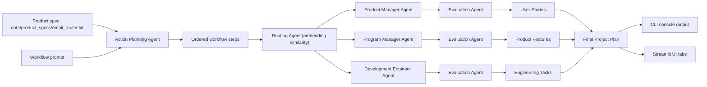

# AI-Powered Agentic Workflow for Project Management

An agentic workflow that turns a product specification into a structured project plan. Give it the **Email Router** product brief and it generates **user stories**, groups them into **product features**, and breaks those down into **engineering tasks** — using a small team of cooperating LLM agents instead of a single prompt.

This addresses a common project-management problem: turning a raw product brief into planning artifacts (stories, features, tasks) is slow, manual, and inconsistent. Here, specialized agents each own one deliverable, a routing agent sends work to the right specialist, and an evaluator checks and corrects each output before it's accepted.

## Features

- **Action planning agent** — decomposes a high-level workflow prompt ("create user stories, features, and tasks") into ordered steps.
- **Specialist worker agents** — a Product Manager agent (user stories), a Program Manager agent (features), and a Development Engineer agent (engineering tasks), each grounded in the product spec via a knowledge-augmented prompt.
- **Routing agent** — uses embedding similarity to send each workflow step to the correct specialist.
- **Evaluator-optimizer loop** — an `EvaluationAgent` checks every worker response against explicit formatting/content criteria and asks the worker to revise until it passes (or a max-iteration limit is hit).
- **Reusable agent toolkit** (`base_agents.py`) — also includes `DirectPromptAgent`, `AugmentedPromptAgent`, and a `RAGKnowledgePromptAgent` (chunking + embeddings + cosine-similarity retrieval) for building other knowledge-grounded agents.
- **Two ways to run it** — a CLI script for console output, and a Streamlit UI for an interactive, tabbed demo of the generated plan.
- **Works with OpenAI or Vocareum keys** — the API base URL is auto-detected from the key prefix (`sk-...` vs `voc-...`) or can be overridden.

## Architecture



Each evaluation loop feeds corrections back to its own worker agent until the response satisfies its criteria or the interaction limit is reached; only the accepted response is passed downstream.

## Project structure

```text
src/email_router_workflow/
  workflow.py                 Builds the agents, runs the pipeline, formats step queries
  openai_config.py            Resolves OpenAI/Vocareum base URL and creates the client
  workflow_agents/
    base_agents.py            DirectPromptAgent, AugmentedPromptAgent, KnowledgeAugmentedPromptAgent,
                               RAGKnowledgePromptAgent, EvaluationAgent, RoutingAgent, ActionPlanningAgent
scripts/
  run_workflow.py             CLI entry point that runs the workflow and prints the plan
data/product_specs/
  email_router.txt            Product specification used as the workflow's input
artifacts/                    Output and runtime scratch space (e.g. RAG chunk/embedding CSVs)
docs/
  project_overview.md         Short narrative of the two build phases
  phase_1/, phase_2/          Phase-specific notes
  assets/banner.svg           README banner image
streamlit_app.py              Interactive Streamlit demo UI
requirements.txt / pyproject.toml   Dependencies and packaging metadata
.env.example                  Template for local environment variables
```

## Setup

Requires Python 3.10+.

```bash
git clone https://github.com/leninathikam/AI-Powered-Agentic-Workflow-for-Project-Management.git
cd AI-Powered-Agentic-Workflow-for-Project-Management
pip install -r requirements.txt
```

Or install the package in editable mode:

```bash
pip install -e .
```

Then configure credentials:

```bash
cp .env.example .env
# edit .env and set OPENAI_API_KEY (sk-... for OpenAI, or voc-... for Vocareum)
```

`OPENAI_BASE_URL` is optional — it's inferred from the key prefix when left unset.

## Usage

### Run from the command line

```bash
python scripts/run_workflow.py
```

This loads the Email Router product spec from `data/product_specs/email_router.txt`, runs the planning -> routing -> evaluation pipeline, and prints the generated user stories, product features, and engineering tasks to the console.

### Run the Streamlit demo

```bash
streamlit run streamlit_app.py
```

Opens an interactive UI where you can view the product brief, edit the workflow prompt, and run the pipeline to see the generated plan in tabs (User Stories / Product Features / Engineering Tasks).

### Deploy the demo

**Streamlit Community Cloud**
1. Push this repo to GitHub.
2. Go to [share.streamlit.io](https://share.streamlit.io) and deploy with main file path `streamlit_app.py`.
3. Add `OPENAI_API_KEY` (and optionally `OPENAI_BASE_URL`) under app secrets.

**Render** — also works, using the start command:
```bash
streamlit run streamlit_app.py --server.port $PORT --server.address 0.0.0.0
```
